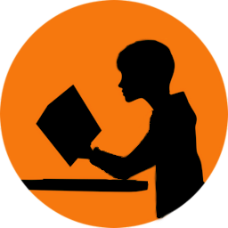
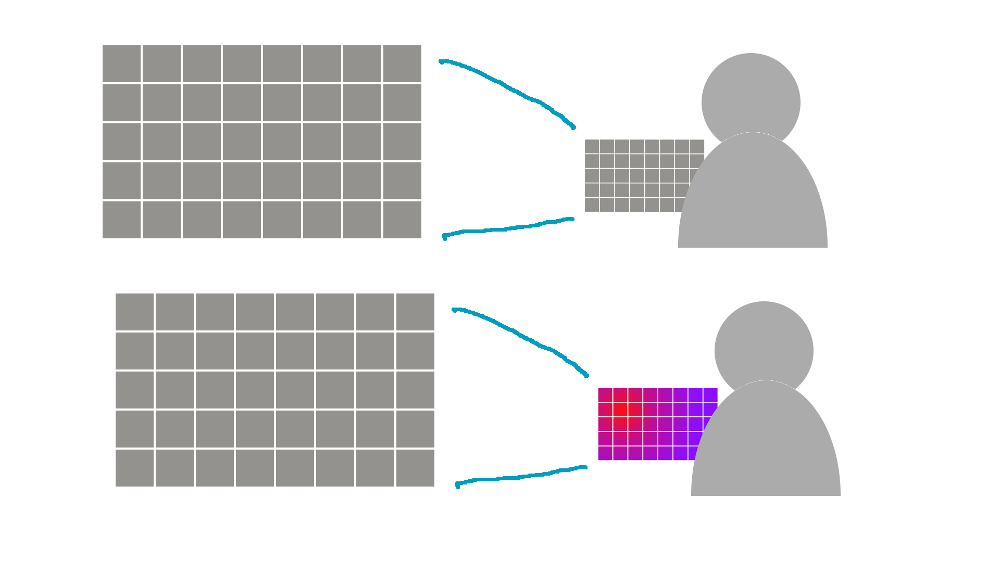
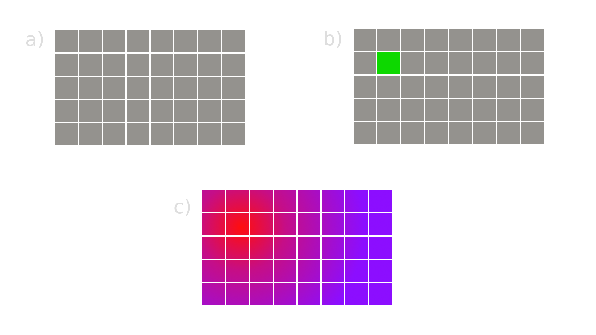
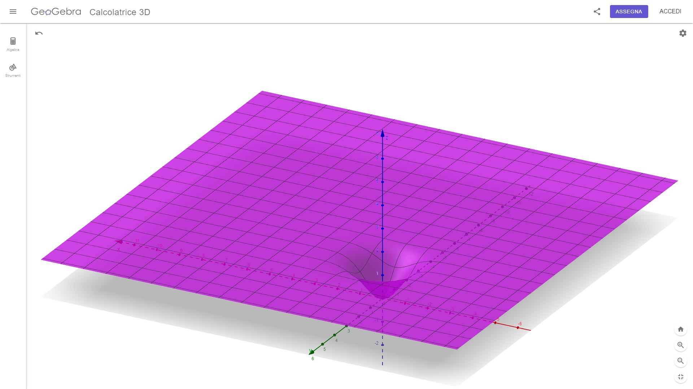

# YourDesk  

Yourdesk is a program made with the intention of solving the classroom seats problem, by automating the disposition generation. 
Yourdesk uses an algorithm that increases the probability of every person of moving away from their last seat to a new position inside the classroom.

<video width="500" height="300" controls><source src=".github/video1.mp4" type="video/mp4"></video>


## Contents

- [Downloading and installing](#download-and-install)
- [How does it work](#how-does-it-work) 
    - [precompiled](#precompiled)
    - [build from source](#build-from-source)
- [School](#a-school-project) 
- [Roadmap](#roadmap)


## Download and install

For now the configuration file used to store the current disposition or to initialize the generation, needs to be written by hand the first time.
In a future version there will be an interface, which will help the user to make changes easily. All the planned changes and features, that will be added in the future can be read in the [roadmap](todo.md) section.

#### Precompiled

To download one of the completed version of the software you can just go to the [releases](https://github.com/TheNemoNemesis/Yourdesk/releases) page, select the correct version and download
the compressed file for the correct platform. Than extract the content and place everything inside the same folder/directory. Than run the executable and 
enjoy the program.

----------------

#### Build from source

To build the program from source first clone the repository using [git](https://git-scm.com/), than navigate to the project directory and build using [zig](https://ziglang.org/) version "0.12.0".

```
git clone https://github.com/TheNemoNemesis/Yourdesk
cd Yourdesk
zig build
```


## How does it work
The algorithm that makes this possible in reality is not too complicated. First we create a grid where to store
all the students, than for each student we make a copy of the grid ([picture 1](.github/img1.png)), to store the informations about it's probability during the generation process.
Each person will have a grid where to store for each seat theirs probability to sit there. The probability is "created" by combining a random number with
a "layer" of pre-determined statistics.
 
In the second picture we can in fact see the process: there is a grid, and for every seat, we calculate the equivalent
value using a formula, shown as an example in the [second image](.github/img2.png) as ***(c)*** (with colors going from red, wich is the lowest, to blue, wich is the highest), or in the [third image](.github/img3.png) as a 3d mathematical function. In the end we "collide" the probabilities, and for each seat we pick the person with the
highest probability to sit there.
 
 


## A school project
This project started in october 2022, when my classmates decided to change seats every month, but couldn't decide a way of doing it giving everyone the opportunity to take seat at the back of the class at leas once.
One of us invented a way of doing so, and asked me to implement it with a software so it would have been faster and easier than doing it by hand; this is how everything started.  
Then in the following 2 year I kept to update the software, losing the old way of doing the disposition, but making the process faster and producing better results. Finally this year it was announced that we had to make some type of work to show
for our last highschool year, and so I decided to make again the project from scratch, so I could present it as my homework. All of this lead to the version you are seeing in this repo, officialy released in may 2024,
with the goal to keep it updated in the yet to follow years. So this is my school project, I hope you enjoy it :p.

## Roadmap
[roadmap](todo.md) 
